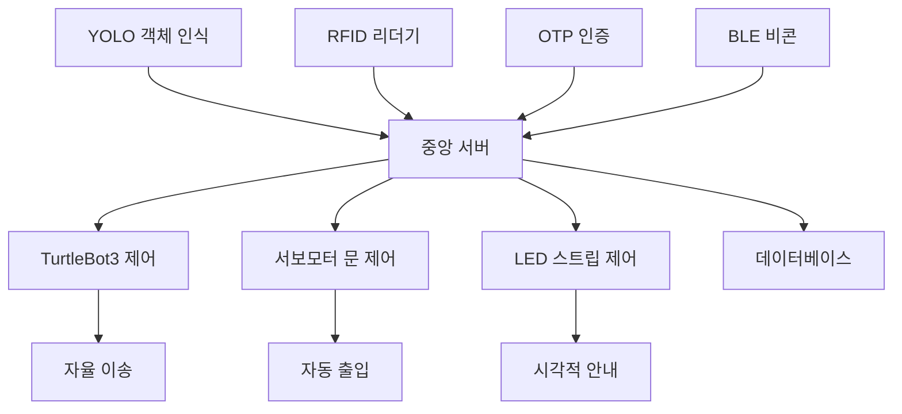

# Smart AIOT 길안내 시스템 - 실버로드
초고령사회를 위한 스마트 실내 길안내 및 이송 시스템

## 프로젝트 소개

실버로드는 초고령사회 진입으로 인한 노약자와 장애인을 위한 스마트 실내 길안내 시스템입니다. 
복잡한 병원이나 공공기관에서 누구나 쉽게 목적지를 찾을 수 있도록 YOLO 객체 인식, RFID 기술, 
자율주행 로봇을 활용한 통합 솔루션을 제공합니다.

### 배경

- 고령 인구: 2025년 20.6%로 초고령사회 진입 예정
- 디지털 격차: 70대 이상 모바일 앱 이용률 20.9%
- 접근성 문제: 복잡한 실내 공간에서의 이동 불편

## 주요 기능

### 스마트 출입 시스템
- YOLO v8 기반 실시간 사람/동물 인식
- 자동 문 개폐 시스템
- TTS 음성 안내

### 보안 인증 시스템
- OTP 기반 사용자 인증
- RFID 카드 발급 및 관리
- 사용자별 맞춤 서비스

### 자율 이송 서비스
- TurtleBot3 기반 자율주행
- SLAM 매핑 및 네비게이션
- 목적지 자동 이송 및 복귀

### LED 길안내 시스템
- BLE 비콘 기반 위치 추적
- 스마트 LED 스트립 경로 표시
- Home Assistant 연동 제어

## 시스템 아키텍처



## 하드웨어 구성

| 구성요소 | 모델 | 용도 |
|---------|------|------|
| AI 처리 | NVIDIA Jetson Nano | YOLO 객체 인식 |
| 메인 컨트롤러 | Raspberry Pi 4B | OTP 인증, LED 제어 |
| 자율 로봇 | TurtleBot3 Burger | 사용자 이송 |
| RFID 제어 | Arduino Uno + MFRC522 | 카드 인식 |
| 위치 추적 | Arduino Nano 33 BLE | BLE 비콘 |
| 문 제어 | SG90 서보모터 | 자동 출입문 |
| LED 안내 | TAPO L930-5 | 시각적 길안내 |

## 설치 및 설정

### 1. 프로젝트 클론

```bash
git clone https://github.com/your-username/silverroad-navigation-system.git
cd silverroad-navigation-system
```

### 2. 프로젝트 구조 생성

```bash
chmod +x setup_project.sh
./setup_project.sh
```

### 3. 의존성 설치

#### Jetson Nano (YOLO 시스템)
```bash
# Python 패키지 설치
pip install ultralytics opencv-python gtts

# 오디오 패키지 설치
sudo apt update
sudo apt install mpg123 -y
```

#### Ubuntu 20.04 (ROS 시스템)
```bash
# ROS Noetic 설치
sudo apt install ros-noetic-desktop-full -y
sudo apt install ros-noetic-turtlebot3-* -y

# 작업공간 설정
mkdir -p ~/catkin_ws/src
cd ~/catkin_ws
catkin_make
source devel/setup.bash
```

#### Arduino IDE
필요한 라이브러리:
- MFRC522 (RFID)
- Servo (서보모터)
- SoftwareSerial (블루투스)
- Arduino_BMI270_BMM150 (IMU 센서)

### 4. 환경 변수 설정

```bash
# ~/.bashrc에 추가
export TURTLEBOT3_MODEL=burger
export ROS_MASTER_URI=http://localhost:11311
export ROS_HOSTNAME=localhost

# ROS 소스
source /opt/ros/noetic/setup.bash
source ~/catkin_ws/devel/setup.bash
```

## 사용 방법

### 1. 서버 시작

```bash
cd server/
./iot_server 5000
```

### 2. 클라이언트 컴파일 및 실행

```bash
cd clients/
gcc iot_client.c -o iot_client -lpthread
gcc iot_bot_client.c -o iot_bot_client -lpthread

# 일반 클라이언트 실행
./iot_client <서버IP> 5000 <클라이언트ID>

# 로봇 클라이언트 실행
./iot_bot_client <서버IP> 5000 <로봇ID>
```

### 3. 비전 시스템 실행

```bash
cd vision/
python3 yolo_iot.py
```

### 4. 로봇 시스템 실행

```bash
# 터미널 1: ROS Master
roscore

# 터미널 2: 로봇 Bringup
cd robotics/launch/
./bringup.sh

# 터미널 3: 네비게이션
./navi.sh
```

### 5. 아두이노 업로드

각 아두이노 보드에 해당하는 스케치를 업로드:
- Arduino Uno: RFID 리더 + 서보모터 제어
- Arduino Nano 33 BLE: BLE 비콘 신호 송출

## 프로젝트 구조

```
silverroad-navigation-system/
├── README.md                    
├── .gitignore                   
├── docs/                       
│   └── 최종보고서.pdf
├── server/                     
│   └── iot_server              
├── clients/                    
│   ├── iot_client.c            
│   └── iot_bot_client.c        
├── vision/                     
│   ├── yolo_iot.py             
│   └── requirements.txt        
├── robotics/                   
│   ├── scripts/               
│   │   ├── go_and_return.py   
│   │   └── RFIDREADER.py      
│   ├── launch/                
│   │   ├── slam.sh            
│   │   ├── teleop.sh          
│   │   ├── navi.sh            
│   │   └── bringup.sh         
│   └── maps/                  
│       └── PJ_map.yaml                 
└── setup_project.sh            
```

## API 문서

### 통신 프로토콜

모든 메시지는 TCP 소켓을 통해 전송되며, 다음 형식을 따릅니다:

#### 인증 메시지
```
[클라이언트ID:PASSWD]
```

#### 센서 데이터
```
[송신자ID]senser@human          # 사람 감지
[송신자ID]senser@dog            # 동물 감지
```

#### 제어 명령
```
[송신자ID]DOOR@OPEN             # 문 열기
[송신자ID]DOOR@CLOSE            # 문 닫기
[송신자ID]RFID1                 # RFID 인식
[송신자ID]FREE_GUIDE@1          # 로봇 복귀
```

### 서버 설정

- IP: 10.10.141.77 (설정 가능)
- Port: 5000
- 프로토콜: TCP
- 인코딩: UTF-8

## 테스트

### 단위 테스트

```bash
# 서버 연결 테스트
cd clients/
./iot_client localhost 5000 TEST_CLIENT

# 비전 시스템 테스트
cd vision/
python3 -c "from yolo_iot import *; print('YOLO loaded successfully')"
```

### 통합 테스트

1. 출입 시스템: 카메라 앞에서 사람 인식 → 문 개방 확인
2. RFID 시스템: 카드 인식 → 서버 메시지 전송 확인
3. 로봇 이송: RFID 인식 → 로봇 이동 → 복귀 확인

## 트러블슈팅

### 자주 발생하는 문제

#### 1. 서버 연결 실패
```bash
# 방화벽 확인
sudo ufw status
sudo ufw allow 5000

# 네트워크 연결 확인
ping <서버IP>
telnet <서버IP> 5000
```

#### 2. YOLO 모델 로딩 실패
```bash
# CUDA 버전 확인 (Jetson Nano)
nvcc --version

# 모델 다운로드
wget https://github.com/ultralytics/assets/releases/download/v0.0.0/yolov8n.pt
```

#### 3. ROS 노드 통신 오류
```bash
# ROS 환경 확인
echo $ROS_MASTER_URI
echo $ROS_HOSTNAME

# 노드 리스트 확인
rosnode list
rostopic list
```

#### 4. 아두이노 업로드 실패
- USB 포트 권한: `sudo chmod 666 /dev/ttyUSB0`
- 보드 선택: Tools → Board → Arduino Uno/Nano 33 BLE
- 포트 선택: Tools → Port → /dev/ttyUSB0

## 팀

| 이름 | 역할 |
|------|------|
| 송이건 | 프로젝트 리더, 시스템 설계 |
| 우승민 | 하드웨어 개발, 아두이노 |
| 유승경 | ROS 개발, 로봇 제어 |
| 장대훈 | 비전 시스템, AI 개발, ROS 개발 |
| 조우찬 | 서버 개발, 네트워크 |
